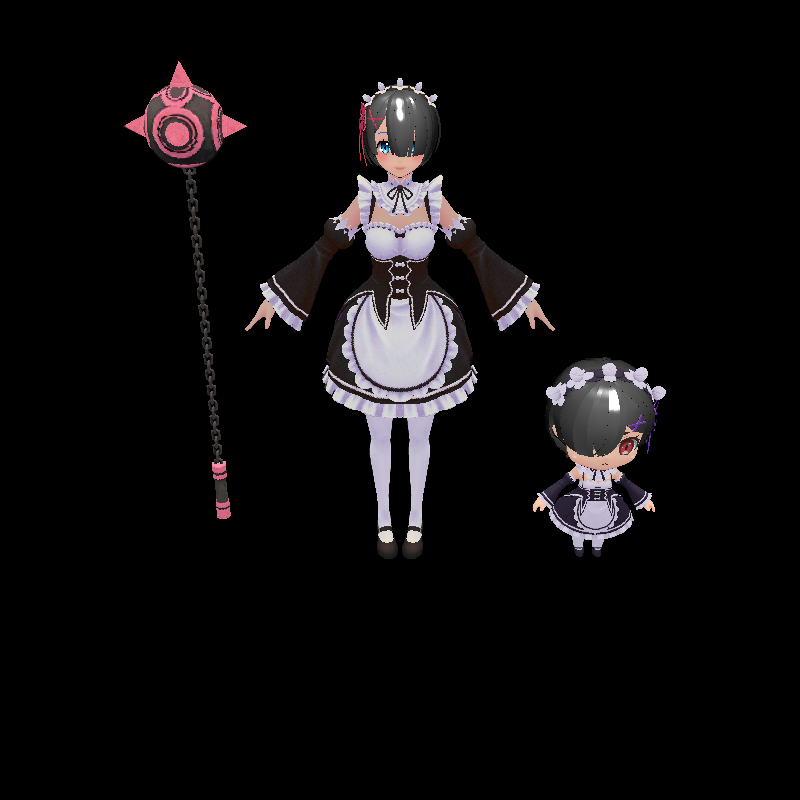
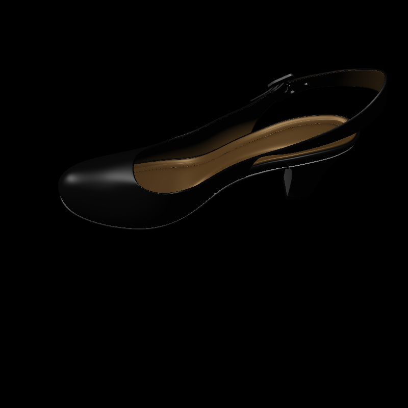

## Introduction

This is my own rasterizer implementation using minimum dependencies(header only as much as possible). Write in C++17, with passion.

## Usage

1. compile
2. `./rasterizer [model]`, model names plz refer to [this README](./assets/README.md)

## Roadmap

- [x] basic rendering pipeline
- [x] texture support
- [x] bling-phong light
- [x] mesh support(broken, no separate texture and material)
- [x] mtl support
- [x] Antialias
    - [x] SSAA
    - [ ] MSAA
- [x] realtime render window
    - [x] MacOS
    - [ ] Linux(Ubuntu?)
    - [ ] Window
- [x] Acceleration
    - [x] Arm64 Mat4 Multiplication
    - [x] Back-face culling
    - [x] OpenMP Parallelism
- [x] hard shadow(PCF implemented)
- [x] soft shadow
- [ ] shader language support(Optional)

## Dependencies

- [LodePNG](https://github.com/lvandeve/lodepng) Load PNG format texture. (Header Only)
- [OBJ Loader](https://github.com/Bly7/OBJ-Loader) Load .obj model file (Header Only)
- [TGA](https://github.com/ColumbusUtrigas/TGA) Load TGA format texture (Header Only)
- [OpenMP](https://www.openmp.org/) Parallelism acceleration(not essential)

## Render Samples

Rem with texture & lighting model.

High heel shoe from Free3d with lighting(implemented without texture).

Display realtime in a window.

## References

- [GAMES101](https://sites.cs.ucsb.edu/~lingqi/teaching/games101.html)
- [zauonlok's renderer](https://github.com/zauonlok/renderew)
- Real-Time Rendering by T. Akenine-Möller, E. Haines, N. Hoffman, A. Pesce, M. Iwanicki, S. Hillaire
