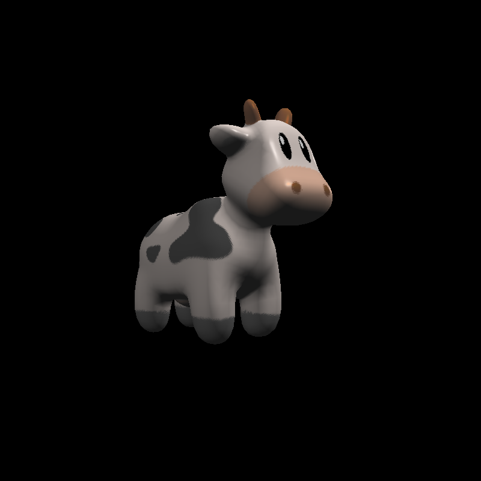

## Introduction

This is my own rasterizer implementation. Developed in C++17.

## Usage

1. compile
2. `./rasterizer [dist] [model] [texture(optional)]`

## Roadmap

- [x] basic rendering pipeline
- [x] texture support
- [x] bling-phong light
- [x] mesh support(broken, no separate texture and material)
- [x] mtl support
- [ ] realtime render window
- [ ] hard shadow
- [ ] soft shadow
- [ ] shader language support(Optional)

## Dependencies

- [LodePNG](https://github.com/lvandeve/lodepng) Load PNG format texture. (Header Only)
- [OBJ Loader](https://github.com/Bly7/OBJ-Loader) Load .obj model file (Header Only)

## Render Samples

GAMES101 Assignment's cow with texture & lighting model.

High heel from Free3d with lighting(implemented without texture).

## Reference

- [GAMES101](https://sites.cs.ucsb.edu/~lingqi/teaching/games101.html)
